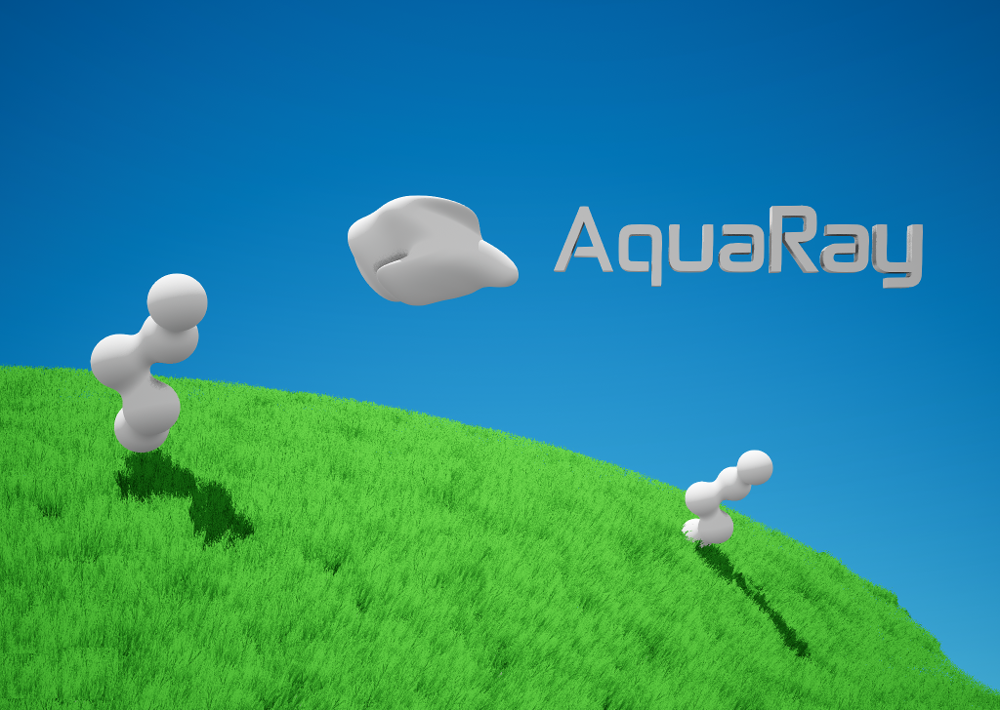
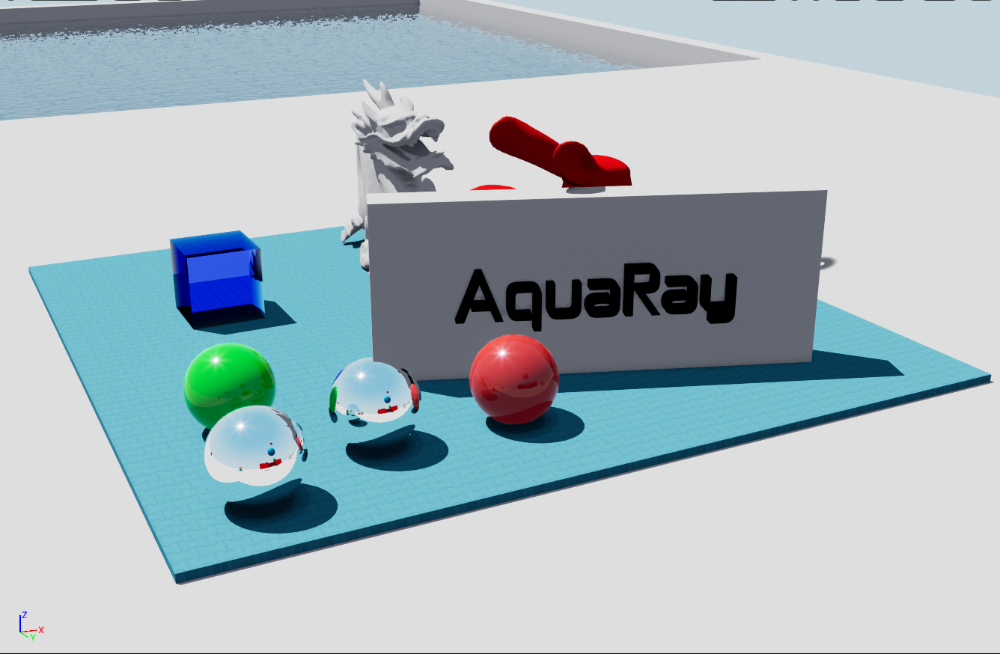
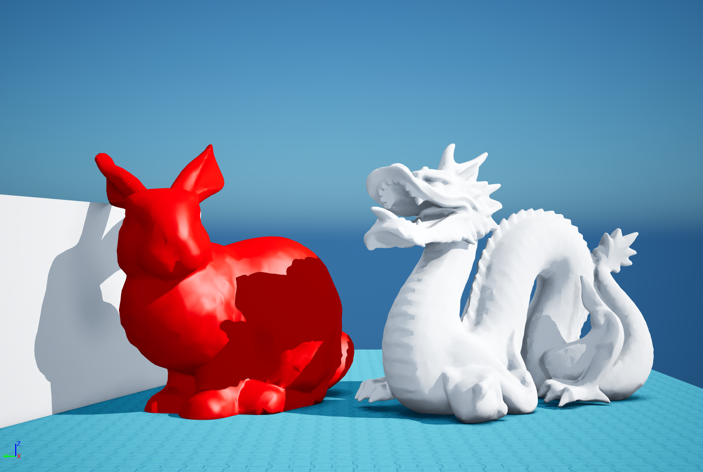
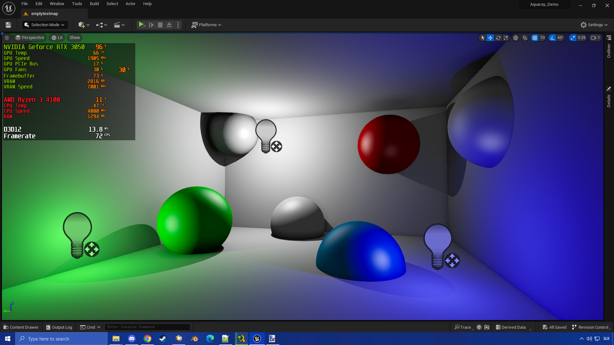

# __AquaRay Raytracer for Unreal Engine 5.2.1 (WIP)__
## V0.8.0
A Custom Hacked-In Hardware Accelerated Realtime Raytracer for Unreal Engine 5.2.1 Built for my Upcoming Project 
SAMPLE PROJECT: https://mega.nz/file/DZgzFZKL#TDsautGjtkMpEODBVYFwjvYCzrVAfbX21R4qgzyx6nc

I have always been fascinated by Raytracing for a long time, wanting to make my own Raytracer for Games with all that sweet lighting, especially focusing on Complex Reflection and Translucency, which I miss in other Raytraced Games. With that, I decided to find a way to implement my own Raytracer into the engine that would suit what I needed. 

After YEARS of brute forcing a solution, I came up with this.... hack. It uses Unreal Engine's Raytracing Debug System to sneak in Custom Raytracing Passes, running them using Console Commands. 

It should work in Unreal 5.2.1, but I'm not sure about other versions (But you can try :D) 

## Scope of Project
- Direct Lighting With Point Light Support 
- Simple One-Ray Shadows 
- 10 steps Reflections & Translucency with Interaction 
- Simple Reflective/Refractive Caustics 
- Some Fog 
- Water 
(also some silly lighting hacks, not too important) 

Currently, this version of AquaRay won't support any kind of Diffuse Raytracing. This is only a Proof of Concept. 
After this, I'm planning to make a Rebuilt Version which will be a combination of Something closer to Standard Raytraced Diffuse Lighting, and the Deep Reflections/Translucency code from this Version. 

Make sure you have a DirectX 16 SM6 Capable GPU with Hardware Acceleration support for Raytracing. The sample project runs around 60-120 fps on my Geforce RTX 3050 (The Framerate is mostly based on how much is on the screen.) 

## Update V0.7.0
- Added Exponential Height Fog 
(Doesnt Handle Thin Transparency Correctly, I want to address that In the Next Iteration of this project 

## __How to Install__
1. Install Unreal Engine 5.2.1 Source  if you havent already 
Should be 110GB in size, make sure to install on a fast drive, or you will be waiting DAYS for it to compile
https://www.unrealengine.com/en-US/ue-on-github 
https://dev.epicgames.com/documentation/en-us/unreal-engine/building-unreal-engine-from-source 
2. Compile a Vannila Build of 5.2.1 and test if its all working 
https://github.com/EpicGames/UnrealEngine/tree/5.2.1-release 
3. Replace/add files from this repository to your Engine Source 
NOTE: For RayTracingDebug.cpp you must find the if statement for enabling the PrimaryRays viewmode in your source, and Replace it with the version on this Repository. Similiar for DeferredShadingRenderer.h 
Other files should be only Replace/Add 
4. Recompile the Engine Again 
5. Download the AquaRay sample Project from this Repository and add it to your Unreal Projects folder 
6. If all stars Align, you should (hopefully) load into the project without any Explosions or Crashes 
Load into "emptytestmap" and Click the AquaRayController Actor in the Outliner 
In the Details Panel, Click "Apply Settings", and "Enable Aquaray" 

After Clicking the button of Doom, you will be either Greeted by a "D3D Crashed" window, or a Fantastic Raytraced Scene in your Viewport 

## __Credits__
The Sample project uses: 
-Skyboxes from [PolyHaven](https://polyhaven.com/) 
-Some Models by the [Stanford University](https://graphics.stanford.edu/data/3Dscanrep/) 

## Gallery

